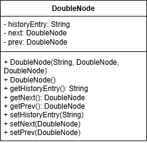
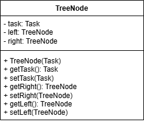

# Task Management System

**Task Management System** allows users to make, manage, prioritize, and edit tasks using advanced data structures. It allows for task storage, task system history, and task analytics using the following data structures:
- Doubly Linked Lists
- Binary Search Trees
- Priority Queues

## Project Structure

```
task-management-system/
├── README.md
├── uml-diagrams/
│ ├── BST.png
│ ├── Double_Node.png
│ ├── Doubly_Linked_List.png
│ ├── Task.png
│ ├── Task_Manager.png
│ └── Tree_Node.png
├── src/
│ ├── BinarySearchTree.java
│ ├── DoubleNode.java
│ ├── DoublyLinkedList.java
│ ├── Task.java
│ ├── TaskComparator.java
│ ├── TaskManager.java
│ ├── TaskManagerProjectExecution.java
│ └── TreeNode.java

```

## Features

**Task Operations**
- Create, edit, and delete tasks
- Clear all tasks
- Search tasks by unique ID

**Task Analytics**
- View task history log (oldest to newest, newest to oldest, or specific task history log entry)
- View tasks by priority
- View tasks by date range

## Dependencies

- **Java 17+** (or later)
- **Git Bash** (Windows) or **terminal** (macOS/Linux)

## Build & Run Instructions

1) Ensure **Java JDK 17+** is installed  
Verify installation by running:  
```bash
java -version
javac -version
```
2) Ensure **Git Bash** is installed and being used as your terminal (Windows only).

     macOS and Linux users can use the **built-in terminal**.

3) Open **Git Bash (Windows)** or your **terminal (macOS/Linux)** and navigate to the project directory. For example:
**Windows (Git Bash example):**
```bash
cd "/c/Users/User/Desktop/task_management_system"
```
**macOS/Linux:**
```bash
cd ~/Desktop/task_management_system
```
4) Compile the Java source files into a **bin/ folder**
```bash
mkdir -p bin
javac -d bin src/*.java
```
5) Run the program
```bash
java -cp bin TaskManagerProjectExecution
```

## Usage Examples
- Create, edit, delete tasks
- Search for tasks by ID
- View task history in different orders
- View tasks by priority or date range

## UML Diagrams

### BinarySearchTree


### Double Node


### Double Linked List


### Task


### Task Manager


### Tree Node


## Author
*Ayra Babar*

## License

This project is licensed under the MIT License.
